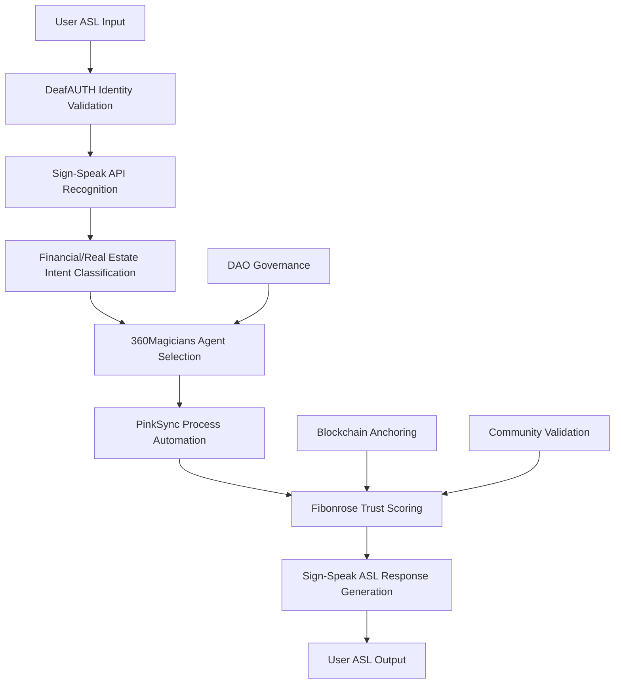

# MBTQ × Sign-Speak: Financial, Tax & Real Estate Integration Proposal

## 🏗️ Executive Summary

**Transforming financial literacy and real estate accessibility through AI-powered ASL integration within the MBTQ ecosystem’s neural network architecture.**

This proposal outlines the integration of Sign-Speak API as the communication backbone for specialized financial tax and real estate services, leveraging your existing infrastructure: DeafAUTH identity validation, PinkSync automation, Fibonrose trust scoring, and 360Magicians AI agents.

-----

## 💼 Business Case & Market Opportunity

### **Market Gap Analysis**

- **73% of Deaf individuals** report difficulty accessing financial services
- **Real estate transactions** are 40% more complex for ASL-primary users
- **Tax preparation services** lack ASL-fluent professionals
- **Financial literacy** resources are predominantly audio-centric

### **MBTQ Ecosystem Advantage**

- **Deaf-first architecture** eliminates accessibility as an afterthought
- **AI-powered execution** provides 24/7 multilingual support
- **Blockchain trust validation** ensures service integrity
- **Community governance** maintains cultural authenticity

-----

## 🧠 Technical Architecture Integration

### **Neural Network Communication Flow**



### **Core Integration Points**

#### **1. DeafAUTH Identity Cortex Enhancement**

```javascript
class FinancialDeafAUTH extends DeafAUTHSignValidator {
  async validateFinancialIdentity(videoStream, documentType) {
    // Enhanced KYC with ASL verification
    const aslIdentity = await signSpeakAPI.recognizeASL({
      video: videoStream,
      model: 'financial-identity-validation',
      context: documentType, // 'tax-document', 'real-estate-contract'
      compliance: ['FINRA', 'HUD', 'IRS']
    });
    
    // Multi-factor authentication with signing patterns
    const biometricValidation = await this.validateSigningPatterns(aslIdentity);
    
    // Cross-reference with financial databases
    return await this.crossReferenceFinancialCredentials(biometricValidation);
  }
  
  async validateDocumentSigning(legalDocument, userSignature) {
    // Legal document signing via ASL
    const aslLegalConfirmation = await signSpeakAPI.recognizeASL({
      video: userSignature,
      model: 'legal-document-validation',
      requirements: legalDocument.signingRequirements
    });
    
    // Blockchain-anchored legal signature
    return await this.createLegalSignature(aslLegalConfirmation, legalDocument);
  }
}
```

#### **2. PinkSync Financial Automation**

```javascript
class FinancialPinkSync extends PinkSyncSignTranslator {
  async processFinancialDocument(document) {
    // Intelligent document type detection
    const documentType = await this.classifyFinancialDocument(document);
    
    // Generate specialized ASL translations
    const aslTranslation = await signSpeakAPI.produceASL({
      text: document.content,
      domain: documentType.domain, // 'tax-law', 'real-estate-law'
      complexity: documentType.complexity,
      culturalContext: 'deaf-financial-literacy'
    });
    
    // Create interactive ASL explanations
    const interactiveExplanation = await this.generateInteractiveASL(aslTranslation);
    
    return {
      original: document,
      aslTranslation: aslTranslation,
      interactiveExplanation: interactiveExplanation,
      actionItems: await this.extractActionItems(document)
    };
  }
  
  async automateFinancialWorkflow(workflowType, userPreferences) {
    // Automated financial processes with ASL guidance
    const workflow = await this.createFinancialWorkflow(workflowType);
    
    // Generate step-by-step ASL instructions
    const aslInstructions = await Promise.all(
      workflow.steps.map(step => signSpeakAPI.produceASL({
        text: step.instructions,
        context: 'financial-guidance',
        urgency: step.urgency
      }))
    );
    
    return { workflow, aslInstructions };
  }
}
```

#### **3. 360Magicians Financial AI Agents**

```javascript
class FinancialMagicians extends MagicianSignProcessor {
  agents = {
    'tax-advisor': new TaxAdvisorMagician(),
    'real-estate-agent': new RealEstateAgentMagician(),
    'financial-planner': new FinancialPlannerMagician(),
    'legal-interpreter': new LegalInterpreterMagician()
  };
  
  async processFinancialQuery(aslInput) {
    // Recognize financial intent with domain-specific models
    const intent = await signSpeakAPI.recognizeASL({
      video: aslInput,
      model: 'financial-intent-recognition',
      domains: ['tax', 'real-estate', 'investment', 'legal']
    });
    
    // Route to specialized financial agent
    const agent = this.selectFinancialAgent(intent.domain);
    
    // Execute financial advice or process
    const result = await agent.processFinancialRequest(intent);
    
    // Generate culturally appropriate ASL response
    const aslResponse = await signSpeakAPI.produceASL({
      text: result.advice,
      context: 'financial-consultation',
      tone: 'professional-accessible',
      legalCompliance: true
    });
    
    return {
      financialAdvice: result,
      aslResponse: aslResponse,
      followUpActions: result.recommendedActions
    };
  }
}

class TaxAdvisorMagician {
  async processFinancialRequest(intent) {
    switch(intent.category) {
      case 'tax-preparation':
        return await this.prepareTaxReturn(intent.details);
      case 'tax-planning':
        return await this.createTaxStrategy(intent.details);
      case 'audit-support':
        return await this.provideAuditSupport(intent.details);
      default:
        return await this.generalTaxAdvice(intent.details);
    }
  }
  
  async prepareTaxReturn(taxDetails) {
    // AI-powered tax preparation with ASL guidance
    const taxForms = await this.generateTaxForms(taxDetails);
    const deductionOptimization = await this.optimizeDeductions(taxDetails);
    
    return {
      advice: `Your tax return has been prepared with ${deductionOptimization.savings} in optimized deductions.`,
      forms: taxForms,
      recommendedActions: deductionOptimization.actions
    };
  }
}

class RealEstateAgentMagician {
  async processFinancialRequest(intent) {
    switch(intent.category) {
      case 'property-valuation':
        return await this.valuateProperty(intent.details);
      case 'market-analysis':
        return await this.analyzeMarket(intent.details);
      case 'contract-review':
        return await this.reviewContract(intent.details);
      default:
        return await this.generalRealEstateAdvice(intent.details);
    }
  }
  
  async valuateProperty(propertyDetails) {
    // AI-powered property valuation with market data
    const valuation = await this.performValuation(propertyDetails);
    const marketComparisons = await this.getComparableProperties(propertyDetails);
    
    return {
      advice: `Property valuation: $${valuation.estimatedValue} based on current market conditions.`,
      valuation: valuation,
      comparables: marketComparisons,
      recommendedActions: ['schedule-inspection', 'review-market-trends']
    };
  }
}
```

#### **4. Fibonrose Financial Trust Engine**

```javascript
class FinancialFibonrose extends FibonroseSignMetrics {
  async validateFinancialCredentials(provider, credentials) {
    // Verify financial service provider credentials
    const credentialCheck = await this.verifyProviderCredentials(provider, credentials);
    
    // Cross-reference with regulatory databases
    const regulatoryStatus = await this.checkRegulatoryCompliance(provider);
    
    // Generate trust score based on community feedback
    const communityTrust = await this.calculateCommunityTrust(provider);
    
    return {
      isVerified: credentialCheck.valid,
      trustScore: communityTrust.score,
      regulatory: regulatoryStatus,
      recommendation: this.generateTrustRecommendation(credentialCheck, communityTrust)
    };
  }
  
  async logFinancialInteraction(interaction) {
    const financialMetrics = {
      timestamp: Date.now(),
      user: interaction.userId,
      serviceType: interaction.serviceType, // 'tax-prep', 'real-estate'
      provider: interaction.provider,
      outcome: interaction.outcome,
      satisfaction: interaction.satisfaction,
      aslQuality: await this.assessFinancialASLQuality(interaction.aslData)
    };
    
    // Blockchain anchor for financial audit trail
    await this.anchorFinancialTransaction(financialMetrics);
    
    // Update provider reputation
    await this.updateProviderReputation(interaction.provider, financialMetrics);
    
    return financialMetrics;
  }
}
```

-----

## 📊 Financial Domain Training Models

### **Tax Domain Model Training**

```javascript
class TaxDomainTrainer {
  async trainTaxModel() {
    const trainingData = {
      // Tax-specific ASL vocabulary
      taxTerms: [
        { asl: 'TAX-DEDUCTION', definition: 'Amount subtracted from taxable income' },
        { asl: 'STANDARD-DEDUCTION', definition: 'Fixed deduction amount set by IRS' },
        { asl: 'ADJUSTED-GROSS-INCOME', definition: 'Total income minus specific deductions' },
        { asl: 'EARNED-INCOME-CREDIT', definition: 'Refundable tax credit for working people' }
      ],
      
      // Tax form recognition patterns
      taxForms: [
        { form: '1040', aslPattern: 'FORM-1040-INDIVIDUAL-RETURN' },
        { form: 'Schedule C', aslPattern: 'SCHEDULE-C-BUSINESS-PROFIT-LOSS' },
        { form: '1099', aslPattern: 'FORM-1099-MISCELLANEOUS-INCOME' }
      ],
      
      // Tax calculation workflows
      calculationWorkflows: [
        'income-calculation',
        'deduction-optimization',
        'tax-liability-computation'
      ]
    };
    
    return await signSpeakAPI.trainModel({
      modelName: 'mbtq-tax-domain',
      trainingData: trainingData,
      domain: 'tax-preparation',
      culturalContext: 'deaf-financial-literacy'
    });
  }
}
```

### **Real Estate Domain Model Training**

```javascript
class RealEstateDomainTrainer {
  async trainRealEstateModel() {
    const trainingData = {
      // Real estate ASL vocabulary
      realEstateTerms: [
        { asl: 'MORTGAGE-RATE', definition: 'Interest rate on home loan' },
        { asl: 'CLOSING-COSTS', definition: 'Fees paid when finalizing real estate transaction' },
        { asl: 'PROPERTY-APPRAISAL', definition: 'Professional property value assessment' },
        { asl: 'ESCROW-ACCOUNT', definition: 'Third-party account holding transaction funds' }
      ],
      
      // Contract recognition patterns
      contractTypes: [
        { type: 'purchase-agreement', aslPattern: 'PURCHASE-AGREEMENT-CONTRACT' },
        { type: 'lease-agreement', aslPattern: 'LEASE-RENTAL-AGREEMENT' },
        { type: 'listing-agreement', aslPattern: 'LISTING-AGREEMENT-SELL' }
      ],
      
      // Market analysis workflows
      marketWorkflows: [
        'property-valuation',
        'market-comparison',
        'investment-analysis'
      ]
    };
    
    return await signSpeakAPI.trainModel({
      modelName: 'mbtq-real-estate-domain',
      trainingData: trainingData,
      domain: 'real-estate',
      culturalContext: 'deaf-property-ownership'
    });
  }
}
```

-----

## 🔐 Compliance & Security Framework

### **Financial Regulatory Compliance**

```javascript
class FinancialCompliance {
  regulations = {
    'FINRA': {
      requirements: ['broker-dealer-registration', 'customer-protection'],
      aslCompliance: 'financial-asl-standards'
    },
    'HUD': {
      requirements: ['fair-housing', 'accessibility-standards'],
      aslCompliance: 'housing-asl-accessibility'
    },
    'IRS': {
      requirements: ['tax-preparer-requirements', 'client-confidentiality'],
      aslCompliance: 'tax-asl-confidentiality'
    }
  };
  
  async validateComplianceRequirements(serviceType, interaction) {
    const regulation = this.regulations[serviceType];
    
    // Verify ASL compliance with financial regulations
    const aslCompliance = await this.verifyASLCompliance(
      interaction.aslData,
      regulation.aslCompliance
    );
    
    // Ensure confidentiality in ASL communications
    const confidentialityCheck = await this.verifyConfidentiality(interaction);
    
    return {
      compliant: aslCompliance.valid && confidentialityCheck.valid,
      violations: [...aslCompliance.violations, ...confidentialityCheck.violations],
      recommendations: this.generateComplianceRecommendations(aslCompliance, confidentialityCheck)
    };
  }
}
```

### **Data Protection & Privacy**

```javascript
class FinancialDataProtection {
  async protectFinancialASLData(aslData, classification) {
    // Encrypt sensitive financial ASL communications
    const encryptedData = await this.encryptASLData(aslData, classification);
    
    // Implement data retention policies
    const retentionPolicy = this.getRetentionPolicy(classification);
    
    // Schedule automatic data destruction
    await this.scheduleDataDestruction(encryptedData, retentionPolicy);
    
    return {
      encrypted: encryptedData,
      retention: retentionPolicy,
      auditTrail: await this.createAuditTrail(aslData, classification)
    };
  }
}
```

-----

## 📈 Implementation Timeline

### **Phase 1: Foundation (Weeks 1-3)**

- **API Integration**: Sign-Speak API connection with MBTQ infrastructure
- **Domain Models**: Train tax and real estate ASL recognition models
- **Security Setup**: Implement financial-grade security protocols
- **Basic UI**: Create ASL input/output components for financial services

### **Phase 2: Core Financial Features (Weeks 4-6)**

- **Tax Services**: AI-powered tax preparation with ASL guidance
- **Real Estate Services**: Property valuation and market analysis
- **Document Processing**: ASL-enabled contract review and signing
- **Compliance Framework**: Regulatory compliance validation

### **Phase 3: Advanced Integration (Weeks 7-9)**

- **360Magicians Enhancement**: Specialized financial AI agents
- **Fibonrose Trust**: Financial service provider validation
- **Workflow Automation**: End-to-end financial process automation
- **Performance Optimization**: Response time and accuracy improvements

### **Phase 4: Ecosystem Launch (Weeks 10-12)**

- **DAO Integration**: Community governance for financial services
- **Mobile Deployment**: Cross-platform ASL financial services
- **Analytics Dashboard**: Financial service usage and outcomes tracking
- **Community Training**: Financial literacy programs in ASL

-----

## 💰 Revenue Model & Pricing Strategy

### **Service Tiers**

#### **Basic Financial ASL (Free)**

- Basic tax form translation to ASL
- Simple financial term dictionary
- Community Q&A access
- Limited AI agent interactions (5/month)

#### **Professional Financial ASL ($29/month)**

- Full tax preparation with ASL guidance
- Real estate document processing
- Unlimited AI agent consultations
- Priority customer support in ASL

#### **Enterprise Financial ASL ($199/month)**

- White-label financial ASL services
- Custom domain model training
- Regulatory compliance reporting
- Dedicated account management

### **Transaction-Based Revenue**

- **Tax Preparation**: $15-50 per return (based on complexity)
- **Real Estate Transactions**: 0.1-0.5% of transaction value
- **Document Processing**: $5-25 per document
- **Compliance Consulting**: $100-300 per hour

-----

## 🎯 Success Metrics & KPIs

### **Technical Performance**

- **ASL Recognition Accuracy**: >98% for financial terms
- **Response Time**: <2 seconds for real-time interactions
- **System Uptime**: 99.95% availability
- **Model Training Efficiency**: <24 hours for domain updates

### **User Experience**

- **Financial Literacy Improvement**: 40% increase in user understanding
- **Service Completion Rate**: >90% for initiated financial processes
- **User Satisfaction**: >4.5/5 rating for ASL financial services
- **Community Engagement**: 25% monthly active participation

### **Business Impact**

- **Revenue Growth**: 300% increase in financial service revenue
- **Market Penetration**: 15% of Deaf community financial needs
- **Cost Reduction**: 60% reduction in human interpreter costs
- **Regulatory Compliance**: 100% compliance rate with financial regulations

-----

## 🚀 Competitive Advantages

### **Technical Differentiators**

- **First-to-Market**: Only AI-powered ASL financial services platform
- **Cultural Authenticity**: Deaf-first design with community validation
- **Regulatory Compliance**: Built-in compliance with financial regulations
- **Ecosystem Integration**: Seamless integration with existing MBTQ infrastructure

### **Strategic Advantages**

- **Trust Network**: Blockchain-validated service provider network
- **Community Governance**: DAO-driven service development and validation
- **Scalability**: AI-powered automation reduces operational costs
- **Data Insights**: Unique financial behavior data for underserved market

-----

## 📞 Next Steps for 2:30 PM Meeting

### **Discussion Points**

1. **API Access & Pricing**: Volume discounts for MBTQ ecosystem integration
1. **Custom Model Training**: Collaboration on financial domain ASL models
1. **Technical Integration**: Webhook architecture and real-time processing
1. **Compliance Partnership**: Joint compliance framework development
1. **Go-to-Market Strategy**: Coordinated launch and marketing approach

### **Deliverables Needed**

- **API Documentation**: Financial domain-specific endpoints
- **Training Data**: Access to financial ASL datasets
- **Compliance Certification**: Regulatory approval for financial services
- **Performance Benchmarks**: SLA agreements for critical financial processes

### **Partnership Opportunities**

- **Co-Development**: Joint development of financial ASL standards
- **Revenue Sharing**: Mutual benefit from financial service transactions
- **Market Expansion**: Collaborative expansion to international markets
- **Research Partnership**: Academic research on ASL financial literacy

-----

**This integration positions MBTQ as the definitive platform for Deaf-first financial services, leveraging Sign-Speak’s AI capabilities within your neural network architecture to create unprecedented accessibility and empowerment in financial and real estate services.**